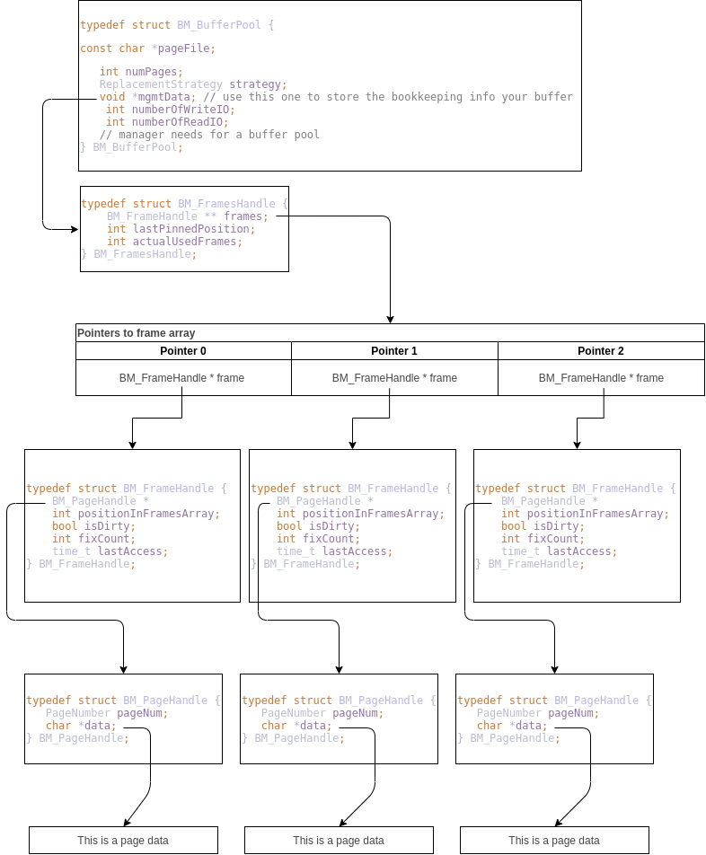

# CS525 Coding assignment 1 : Storage manager
## Group
|Student name| iit mail|
|---|---|
|Decou Nathan|[ndecou@hawk.iit.edu](mailto:ndecou@hawk.iit.edu)|
|Fernandez	Mateo|[mfernandezlopezareal@hawk.iit.edu](mailto:mfernandezlopezareal@hawk.iit.edu)|
|Santana	Mikel|[msantanamarana@hawk.iit.edu](mailto:msantanamarana@hawk.iit.edu)|

## How to compile and run
- To compile the test file use the Makefile rule `make test_assign2_1`
- To run the tests use the Makefile rule `make run_test_assign2_1`.
> :arrow_up: This rule will compile **and** run the tests. No need to use `make test_assign1` before.
- Use `make memory_check_test_assign2_1` to check for memory leaks.
> :arrow_up: This rule will compile **and** run the tests using Valgrind. No need to use `make test_assign1` before.
- To clean (i.e. remove binary files, temporary files etc.) use `make clean`

## Added tests scenarios
Regarding the tests, we did not add any new but use the ones which were already created. All of them work as expected.

## Code explanation
### What it is in buffer pool
We decided to create two new structures in order to save the pages in frames. Those structures are
`BM_FramesHandle` and `BM_FrameHandle`. `BM_FramesHandle` is just a structure containing an array of pointer to BM_FramePointer 
and additional information in order to compute the insertion/deletion in the array.

`BM_FrameHandle` is structure containing a pointer to a BM_PageHandle and other information about the frame such as 
the last time it was access or if it is dirty or not.

Also in order to know how many I/O read and write will be performed during the use of the buffer pool we add 2 attributes in it.
`numberOfWriteIO` and `numberOfReadIO`. Those are updated each a read or write is done on the file.

A picture is worth a thousand words so the figure below shows the structure of a buffer pool with 3 frames. Each arrow represents a C pointer.

### Initializing the buffer pool
In order to initialize the buffer pool we first check if the associated file exists. If not we return an error.

If it exists then we just fill the attributes with their init values. `mgmtData` points to a newly created `BM_FramesHandle`. 

In order to create this `BM_FramesHandle` we implemented a function called `createFrames` which creates a `BM_FramesHandle`
containing an array of `NULL` pointers. The size of the array is the number of frames given to `initBufferPool`.

### Pin a page
The function `pinPage` does quite a few things.

First it checks if the wanted page is not already in the buffer pool. To do that we implemented the function `findFrameNumberN`
which takes a buffer pool and a page number and check if a frame contains a page with the same page number and if so returns it, else returns `NULL`.
If the page is already in the buffer pool we put its content in the corresponding attributes of the page passed in parameter. We also update 
the last access time, the last pinned page in the `BM_FramesHandle` and increment the fix count.

If the wanted page is not n the buffer pool we then search if there is a empty place in the frame array (= a `NULL` pointer). If so
we read the page from the disk and put it in the available frame while putting the right values in its attributes.

If no place were found then depending on the strategy chosen by the user we chose a page to evict and put the new page in the frame.

#### Implemented strategy
We implemented two strategies : `FIFO` and `LRU`.

In order to implement `FIFO` we use the array as a circular buffer. When we need to evict a frame we chose the one after the
last pinned one. Which is thus the first that came in the buffer.

To implement `LRU` we keep track of when the frames are access. To do that each frame has an attribute which contains the 
last time it was access. When we need to evict a page we loop over the deletable frame in the array (i.e frames with a 0 fix count).
The frame with the older timestamp is evicted.

### Shutting down the buffer pool
At the end of the program the user should shut down the buffer pool by calling `shutdownBufferPool`.

This function loops over the frames and write to disk all the dirty ones. At the same time it frees all the allocated memory used by the buffer pool.
If one of the frame has a none 0 fix count then an error is returned.

### Force flush pool
At any moment the user can force flush the buffer pool by calling the function `forceFlushPool`. 

This function loops over the frames and write to disk all the dirty ones. After this function all frames are clean.
